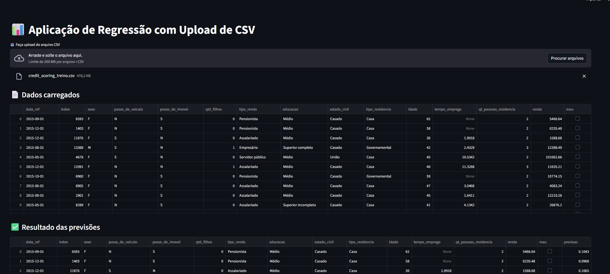

📊 Aplicação Streamlit — Predição com Modelo de Regressão

Esta aplicação em Streamlit permite o upload de um arquivo CSV, realiza o pré-processamento dos dados via pipeline do scikit-learn e utiliza um modelo de regressão treinado e salvo em .pkl para gerar predições.

O pipeline inclui:

Tratamento de variáveis numéricas e categóricas

Transformações (log, one-hot encoding)

Redução de dimensionalidade com PCA

Modelo de regressão treinado previamente em notebook

## 🎥 Demonstração da Aplicação

